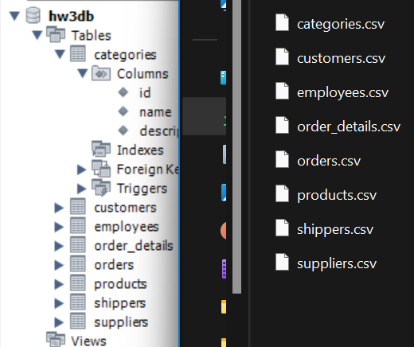
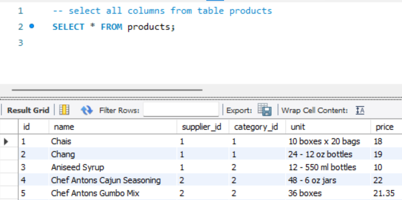
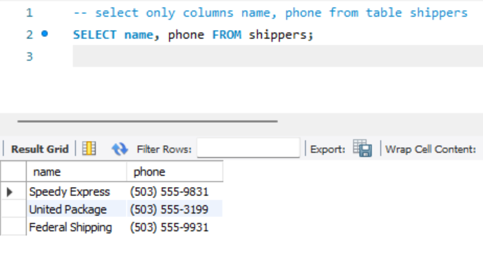
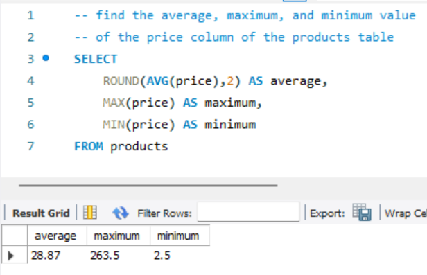
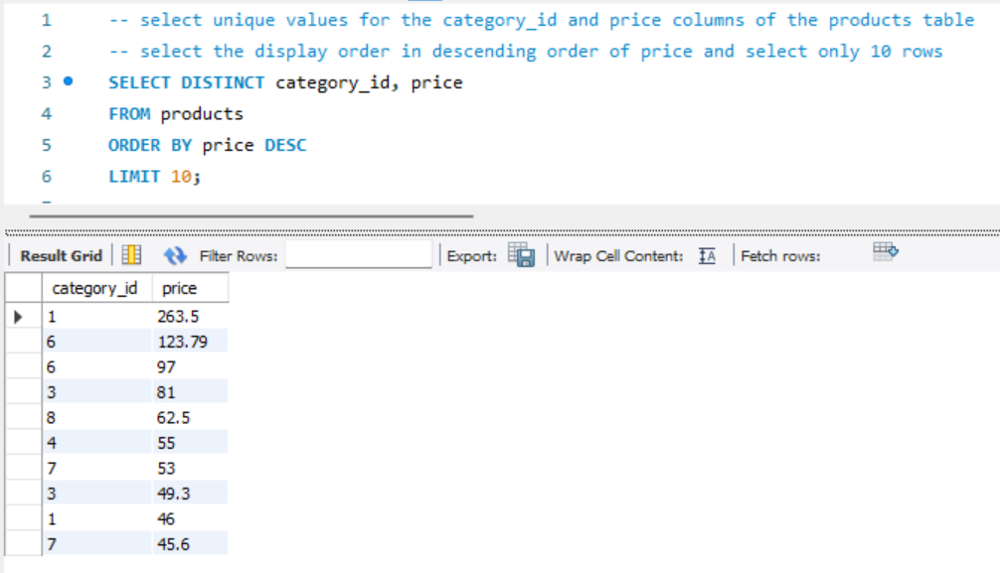
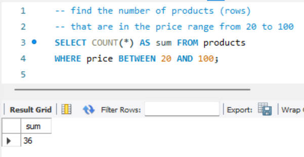
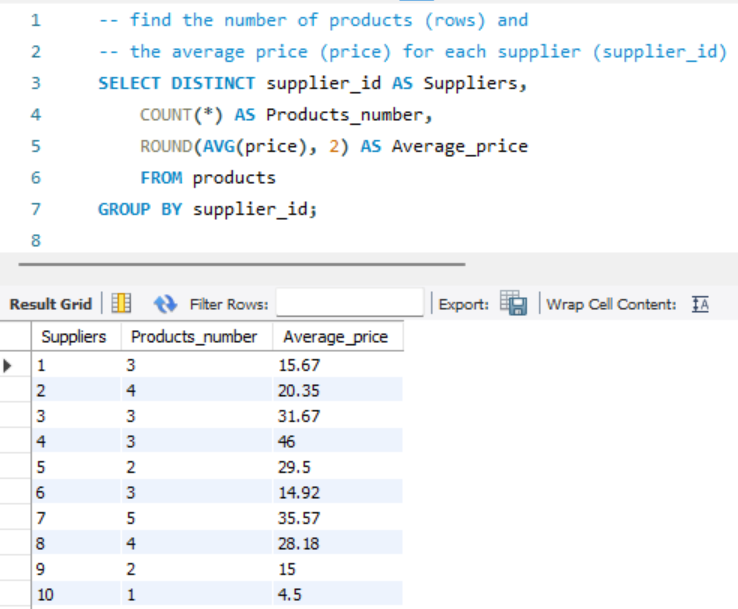

# goit-rdb-hw-03

### [Create DB](./createdb.png)

### [Commands](./HW3_SQL_commands.txt)

## Task 1.1

### [Select all columns from table products](./task1.1_selectAll.png)

## Task 1.2

### [Select only columns name, phone from table shippers](./task1.2_selectSelected.png)

## Task 2

### [Find the average, maximum, and minimum value](./task2_AvgMaxMin.png)

## Task 3

### [Select unique values](./task3_uniqueValues.png)

## Task 4

### [Find the number of products between 20 and 100](./task4_sum.png)

## Task 5

### [Find for each supplier the NUM of products and AVG price](./task5_supplierSum.png)

